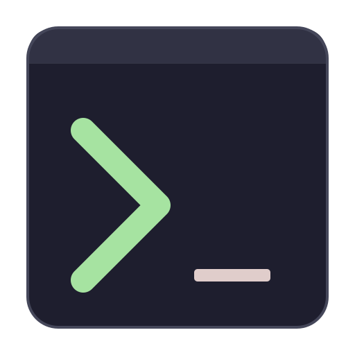

# ori-term

<p>
  A GPU-accelerated, multiplexer-native terminal emulator written from scratch in Rust.
  <br /><br />
  <a href="#about">About</a>
  ·
  <a href="https://oriterm.com/install">Install</a>
  ·
  <a href="https://oriterm.com/features">Features</a>
  ·
  <a href="https://oriterm.com/docs">Documentation</a>
  ·
  <a href="https://oriterm.com/roadmap">Roadmap</a>
</p>

> **Status: alpha.** Daily-driver-capable on Linux, Windows, and macOS. Core terminal emulation, GPU-accelerated rendering, splits, floating panes, tabs, themes, ligatures, and inline images all work today. Sessions that survive after the window closes, remote shells over SSH/WSL, and a headless terminal-in-terminal client are still landing — see [Roadmap](#roadmap).

## About

ori-term is a terminal emulator that bundles three things normally stacked together — a terminal, a multiplexer, and a window shell — into one application:

- **GPU-accelerated rendering.** Smooth scrolling under heavy output. Idle CPU drops to almost nothing when nothing is changing, so battery and fans stay quiet.
- **Splits, tabs, and floating panes built in.** No tmux required. Drag tabs between windows; nested splits and floating panes layer freely.
- **Cross-platform from day one.** Windows, Linux, and macOS get the same terminal — same features, same keybindings, same look. No platform was an afterthought.

Full feature list and screenshots live on the website: [oriterm.com/features](https://oriterm.com/features).

## Install

Pre-built binaries for Linux, macOS, and Windows are on the [GitHub releases page](https://github.com/upstat-io/ori-term/releases).

On Linux and macOS, the install script picks the right binary, downloads it, and drops it in `~/.local/bin`:

```sh
curl -fsSL https://oriterm.com/install.sh | sh
```

See [oriterm.com/install](https://oriterm.com/install) for Windows downloads and per-platform notes.

## Build from source

The Cargo workspace lives in `term_repo/`. The toolchain is pinned in `rust-toolchain.toml` — `rustup` selects it automatically.

```sh
git clone https://github.com/upstat-io/ori-term.git
cd ori-term/term_repo
cargo build --release
```

To cross-compile for Windows from Linux/WSL:

```sh
rustup target add x86_64-pc-windows-gnu
cargo build --release --target x86_64-pc-windows-gnu
```

`./build-all.sh` runs both targets; `./test-all.sh` runs the workspace test suite.

## Roadmap

| Step | Status |
|------|--------|
| Standards-compliant terminal emulation (full escape-sequence support, modes, palette, SGR, OSC, DCS) | Complete |
| GPU-accelerated rendering with smooth scrolling and near-zero idle CPU | Complete |
| Cross-platform window chrome (frameless, Aero Snap, transparent blur, vibrancy) | Complete |
| Splits, floating panes, tabs, multi-window | Complete |
| Multiplexer foundation (background process for shell sessions, embedded fallback for sandboxes) | Complete |
| Image protocols (Kitty graphics, Sixel, iTerm2 inline images) — decoding shipped, animation/z-index hardening in progress | Partial |
| Multi-process window architecture — separate process per window for crash isolation and shared sessions | Partial |
| Terminal protocol extensions (terminfo query, broader window manipulation reports) | Partial |
| Session persistence + remote domains (SSH, WSL) | Todo |
| Remote attach + network transport (TCP+TLS, Mosh-style predictive echo) | Todo |
| Headless TUI client (`oriterm-tui` — tmux replacement) | Todo |
| Lua scripting + command palette + vi mode + hints | Todo |
| macOS app bundle, native scrollbars, minimap | Todo |

Live roadmap: [oriterm.com/roadmap](https://oriterm.com/roadmap).

## Inspiration

ori-term borrows ideas from many terminal emulators and UI projects: Alacritty (terminal state model, lock discipline), Ghostty (cell-by-cell reflow, fast mode tables), WezTerm (multiplexer domain model, portable PTY abstraction), Chrome (tab drag-and-drop, GPU UI), VS Code (frameless window chrome), tmux (daemon architecture), Mosh (predictive echo), Catppuccin (default palette), and Ratatui / termenv / lipgloss (testing and color-detection patterns).

## The Name

**ori** — from the Japanese 折り (folding). Tabs fold between windows the way you fold paper.

## License

MIT.
